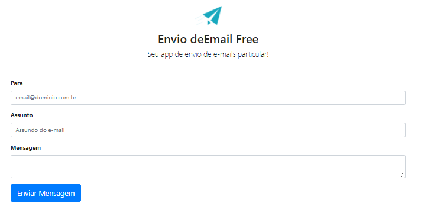

[![LinkedIn][linkedin-shield]][linkedin-url]
[![MIT License][license-shield]][license-url]


<!-- PROJECT LOGO -->
<br />
<p align="center">
  <a href="https://github.com/FellipeCarvalho/sendEmailFree">
    
  </a>

  <h3 align="center">Como enviar email através de um formulário em PHP</h3>

  <p align="center">
    Insira um formulário com envio de email em seus projetos
    <br />
    <a href="https://github.com/FellipeCarvalho/sendEmailFree/"><strong>Explore o conteúdo »</strong></a>
    <br />
    <br />
<p align="center">
    <a href="https://github.com/FellipeCarvalho/sendEmailFree/issues">Reporte Bugs</a>
    ·
    <a href="https://github.com/FellipeCarvalho/sendEmailFree/issues">Solicite novos Recursos </a>
  </p>
</p>


<!-- TABLE OF CONTENTS -->
<details open="open">
  <summary>Conteúdo</summary>
  <ol>
    <li>
        <a href="#Sobre-o-Projeto">Sobre o Projeto</a>
        <ul>
          <li><a href="#desenvolvido-com">Tecnologia utilizada</a></li>
        </ul>
    </li>
      <li> 
         <a href="#Iniciando">Iniciando</a>
      <ul>
        <li><a href="#Pre-requisitos">Pré-requisitos</a></li>
        <li><a href="#Configuracao">Configuração</a></li>
      </ul>
    </li>
    <li><a href="#Contribuicao">Contribuição</a></li>
    <li><a href="#license">Licença</a></li>
    <li><a href="#Contato">Contato</a></li>

  </ol>
</details>


<!-- ABOUT THE PROJECT -->
## Sobre o Projeto
<p align="center>
  <a href="https://github.com/FellipeCarvalho/sendEmailFree">
    
  </a>
</p>
Através desse repositório é possível criar um formulário simples com HTML5+Bootrap e enviar emails diretamente a partir do formulário utilizando a biblioteca PHPmailer do PHP, usando o PHP POO.
Um projeto simples que pode ajudar quem esta iniciando com PHP e deseja enviar emails a partir de formulários ou acrescentar a biblioteca PHPmailer em seus projetos.
                                                                

### Desenvolvido com

O exemplo foi desenvolvido com as tecnologias abaixo.
* [Bootstrap](https://getbootstrap.com)
* [HTML5](https://html5up.net/)
* [PHP](https://www.php.net/)


<!-- GETTING STARTED -->
## Iniciando

O primeiro passo é fazer um clone do projeto para o repositório em seu computador.

### Pre requisitos

Para este exemplo você vai precisar ter em seu computador/repositório a instalação básica do XAMMP ou WAMPP da versão superior 7 ou superior. Ou ainda uma hospedagem já com servidor apache configurado.

Ter uma conta de email com as seguintes informações:
* Email
* Senha
* Endereço smtp
* Porta SMTP
* Saber se seu email usa configuração TSL, SSL ou não tem criptografia.

### Configuracao

1. Faça o clone desse repositório 
2. Abra o arquivo "processa_envio_email.php" com editor de sua preferência
3. Edite a linha 71 onde pede o servidor de email, para o servidor do seu email:
   ``` $mail->Host = 'smtp.servidoemailexemplo.com.br';  ```

4. Edite a linha 73 onde pede o seu email que será usado para envio de emails
   ```$mail->Username = 'email@exemplo.com';  ```
5. Edite a linha 74 e coloque a senha do seu email (essa senha não deve ser compartilhada, após inserir nesse trecho uma recomendação de segurança é colocar o arquivo fora do diretório público, fazendo apenas sua referência)
     ```$mail->Password = 'senhadoseuemailexemplo'; ```
6. Edite a linha 75 caso não seja "SSL" a configuração do seu email, deixe vazio caso não tenha.
    ```$mail->SMTPSecure = 'ssl'; ```
7. Edite a linha 76 e insira a porta do seu servidor de email
   ```$mail->Port = 465; ```
8. Edite a linha 79 e insira o seu email novamente, esse será o email de envio
   ```$mail->setFrom('email@exemplo.com'); ```

Após feito essas etapas, o seu projeto já estará pronto para enviar emails a partir do formulário.


<!-- CONTRIBUTING -->
## Contribuicao

Contribuir faz com que as comunidades open source crescam, sinta-se a vontade e contribua com seu talento!

1. Crie um Fork desse Projeto
2. Crie o seu recurso em um novo branch (`git checkout -b feature/AmazingFeature`)
3. Commit suas alterações (`git commit -m 'Add some AmazingFeature'`)
4. De um Push no Branch (`git push origin feature/AmazingFeature`)
5. Na opção do GitHub "Pull Request"  clique em  "PullRequest" das alterações que você realizou


<!-- LICENSE -->
## License

Distribuição sob MIT License. Veja `LICENSE` para mais informações.


<!-- CONTACT -->
## Contato

Fellipe Carvalho - [https://br.linkedin.com/in/fellipe-carvalho-6b688190](https://br.linkedin.com/in/fellipe-carvalho-6b688190) - fellipealbert3@gmail.com

Link do Projeto: [https://github.com/FellipeCarvalho](https://github.com/FellipeCarvalho/sendEmailFree)


<!-- MARKDOWN LINKS & IMAGES -->
<!-- https://www.markdownguide.org/basic-syntax/#reference-style-links -->
[contributors-shield]: https://img.shields.io/github/contributors/othneildrew/Best-README-Template.svg?style=for-the-badge
[contributors-url]: https://github.com/othneildrew/Best-README-Template/graphs/contributors
[forks-shield]: https://img.shields.io/github/forks/othneildrew/Best-README-Template.svg?style=for-the-badge
[forks-url]: https://github.com/othneildrew/Best-README-Template/network/members
[stars-shield]: https://img.shields.io/github/stars/othneildrew/Best-README-Template.svg?style=for-the-badge
[stars-url]: https://github.com/othneildrew/Best-README-Template/stargazers
[issues-shield]: https://img.shields.io/github/issues/othneildrew/Best-README-Template.svg?style=for-the-badge
[issues-url]: https://github.com/othneildrew/Best-README-Template/issues
[license-shield]: https://img.shields.io/github/license/othneildrew/Best-README-Template.svg?style=for-the-badge
[license-url]: https://github.com/othneildrew/Best-README-Template/blob/master/LICENSE.txt
[linkedin-shield]: https://img.shields.io/badge/-LinkedIn-black.svg?style=for-the-badge&logo=linkedin&colorB=555
[linkedin-url]: https://linkedin.com/in/fellipe-carvalho-6b688190
[product-screenshot]: images/screenshot.png


